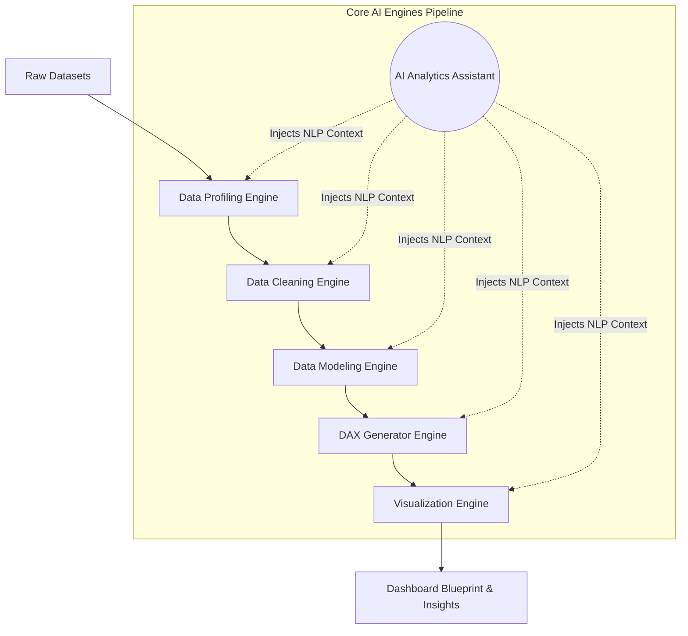

[Back to Documentation Home](../../README.md)

# Core Features

InsightFlow provides several intelligent engines to assist with the entire data lifecycle.

## Engine Architecture

## Data Profiling & Cleaning
When a user uploads one or more datasets (CSV, Excel, or database exports), InsightFlow performs a comprehensive **Data Profiling** process. It examines column types, missing values, duplicate records, unique values, outliers, date fields, categorical variables, and numerical measures.

Based on this analysis, the **Data Cleaning Assistant** provides recommendations such as:
- Handling missing values
- Removing duplicates
- Correcting data types
- Standardizing formats
- Detecting outliers and inconsistent records

## Data Modeling
The platform analyzes relationships between datasets and generates **Data Modeling Suggestions**. It automatically identifies:
- Potential primary and foreign keys
- Fact and dimension tables
- Optimal schema structures (Star Schema or Snowflake Schema)

## DAX Measure Generator
By examining the available metrics and dimensions, InsightFlow suggests relevant DAX measures along with complete formulas and explanations (e.g., Total Sales, Profit Margin, Year-to-Date Sales, Month-over-Month Growth).

## Visualizations and Dashboards
To simplify dashboard creation, the **Visualization Recommendation System** suggests the most suitable charts based on the dataset and business objectives. The **Dashboard Blueprint Generator** provides a complete dashboard structure with recommended pages, KPIs, visualizations, filters, slicers, and drill-down capabilities.

## AI Analytics Assistant
An intelligent assistant that allows users to ask questions about their data in natural language. The assistant explains data quality issues, recommends analytical approaches, describes DAX calculations, and helps users understand how to derive meaningful insights.
