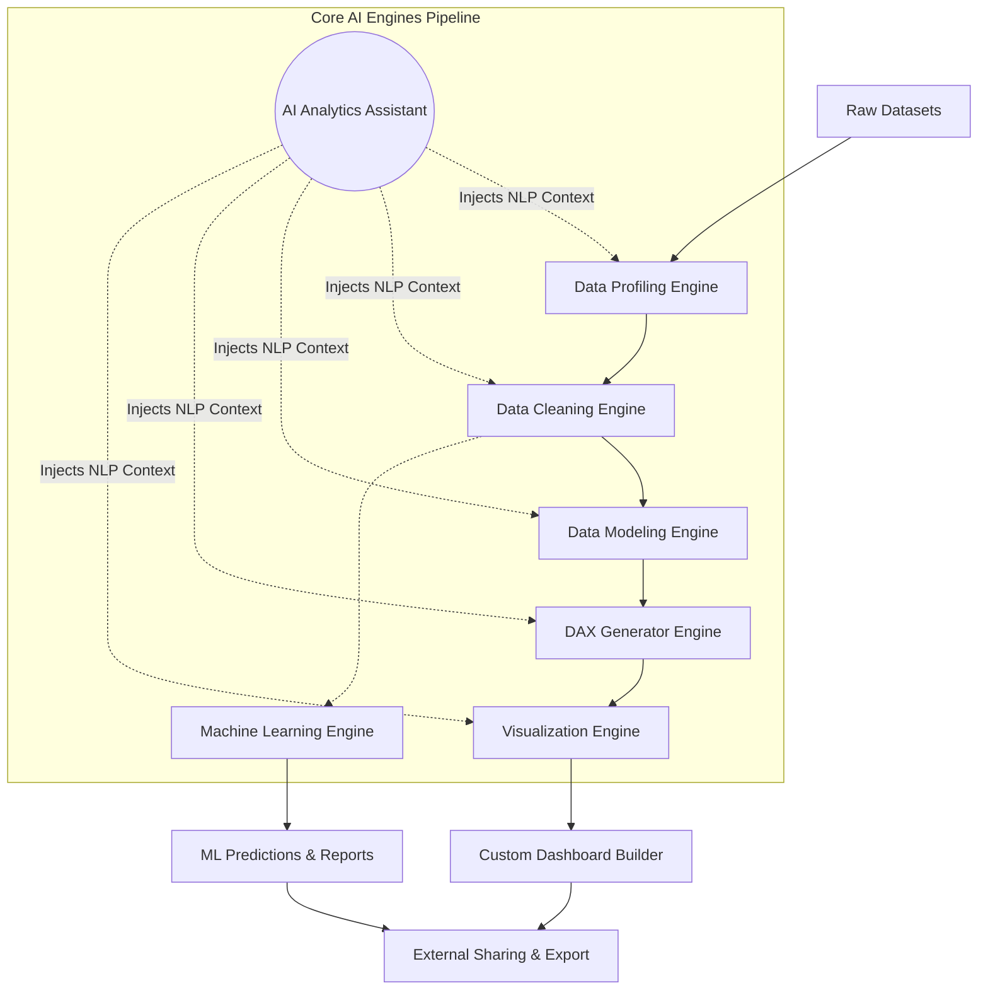

[Back to Documentation Home](../../README.md)

# Core Features

InsightFlow provides several intelligent engines to assist with the entire data lifecycle.

## Engine Architecture

```mermaid
graph TD
    Data["Raw Datasets"] --> Engine1
    
    subgraph "Core AI Engines Pipeline"
        Engine1["Data Profiling Engine"] --> Engine2["Data Cleaning Engine"]
        Engine2 --> Engine3["Data Modeling Engine"]
        Engine3 --> Engine4["DAX Generator Engine"]
        Engine4 --> Engine5["Visualization Engine"]
        Engine2 -.-> MLEngine["Machine Learning Engine"]
        
        Assistant(("AI Analytics Assistant")) -.->|"Injects NLP Context"| Engine1
        Assistant -.->|"Injects NLP Context"| Engine2
        Assistant -.->|"Injects NLP Context"| Engine3
        Assistant -.->|"Injects NLP Context"| Engine4
        Assistant -.->|"Injects NLP Context"| Engine5
    end
    
    Engine5 --> DashboardBuild["Custom Dashboard Builder"]
    MLEngine --> MLPredict["ML Predictions & Reports"]
    
    DashboardBuild --> Share["External Sharing & Export"]
    MLPredict --> Share
```

## Data Profiling & Cleaning
When a user uploads one or more datasets (CSV, Excel, or database exports), InsightFlow performs a comprehensive **Data Profiling** process. It examines column types, missing values, duplicate records, unique values, outliers, date fields, categorical variables, and numerical measures.

Based on this analysis, the **Data Cleaning Assistant** provides recommendations such as:
- Handling missing values
- Removing duplicates
- Correcting data types
- Standardizing formats
- Detecting outliers and inconsistent records

## Data Modeling
The platform analyzes relationships between datasets and generates **Data Modeling Suggestions**. It automatically identifies:
- Potential primary and foreign keys
- Fact and dimension tables
- Optimal schema structures (Star Schema or Snowflake Schema)

## DAX Measure Generator
By examining the available metrics and dimensions, InsightFlow suggests relevant DAX measures along with complete formulas and explanations (e.g., Total Sales, Profit Margin, Year-to-Date Sales, Month-over-Month Growth).

## Machine Learning Builder
The platform features an integrated **Machine Learning Builder** that allows users to train predictive models on their cleaned datasets. Users can generate ML Reports to evaluate model performance and utilize the prediction interface to forecast outcomes directly from their data.

## Visualizations and Custom Dashboard Builder
To simplify dashboard creation, the **Visualization Recommendation System** suggests the most suitable charts based on the dataset and business objectives.

Users can then leverage the **Custom Dashboard Builder** to:
- Construct interactive dashboards using flexible layouts (e.g., Grid, Executive Summary, Spotify-style).
- Apply custom themes and font pairings to match organizational branding.
- Select and configure various charts including KPIs, Line, Bar, Pie, and Scatter plots.

## AI Analytics Assistant
An intelligent assistant that allows users to ask questions about their data in natural language. The assistant explains data quality issues, recommends analytical approaches, describes DAX calculations, and helps users understand how to derive meaningful insights.

## Sharing & Collaboration
InsightFlow facilitates collaboration by allowing users to securely share their insights with stakeholders. Users can generate public, token-based links for both **Custom Dashboards** and **Analytical Reports**. These links provide external users with interactive access to the data without requiring an InsightFlow account.
