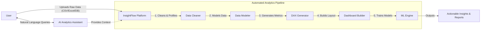

[Back to Documentation Home](../../README.md)

# System Overview

**InsightFlow** is a SaaS platform that automates the most time-consuming stages of the data analytics workflow. 

## High-Level Concept

## The Problem
Traditionally, analysts spend significant time understanding datasets, identifying data quality issues, creating relationships between tables, writing DAX calculations, and deciding which charts best represent the data.

## The InsightFlow Solution
InsightFlow streamlines this entire process through AI-powered analysis and automation. It helps data analysts, Power BI developers, students, and business users transform raw datasets into actionable insights by providing intelligent recommendations for:

- Data cleaning
- Data modeling
- DAX measures
- Visualizations
- Dashboard design

## Project Vision
InsightFlow aims to become the "Copilot for Data Analytics" by automating data preparation, modeling, metric generation, and dashboard planning. The platform reduces manual effort, accelerates analytics workflows, and empowers users to focus on generating insights rather than spending hours on repetitive technical tasks.

## Target Users
- Data Analysts
- Power BI Developers
- Business Intelligence Professionals
- Data Science Students
- Business Managers
- Consultants
- Freelancers
- Organizations building analytical dashboards
