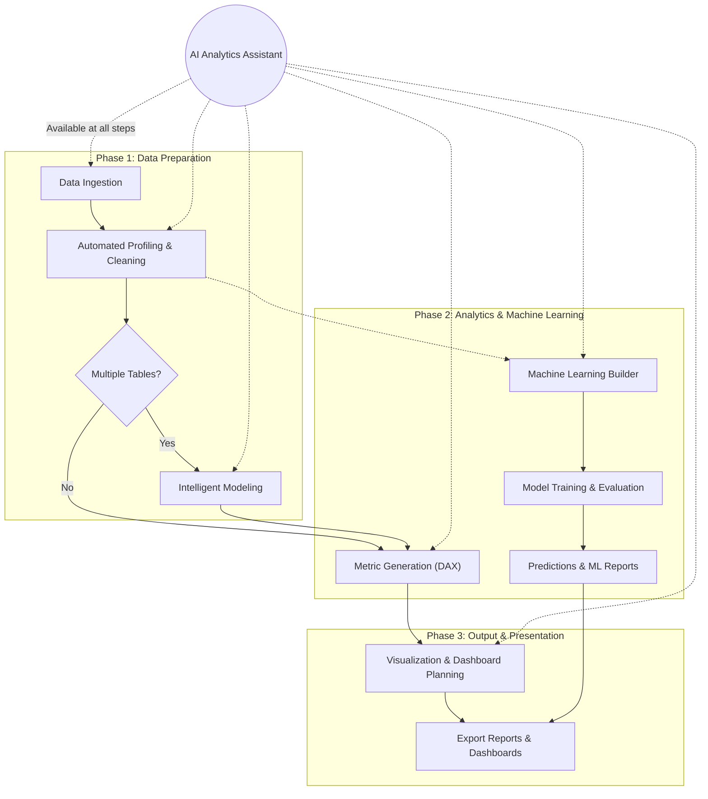

[Back to Documentation Home](../../README.md)

# User Workflows

InsightFlow is designed to support various user personas through a unified, intelligent workflow. The platform guides users from raw data to a complete dashboard blueprint.

## The End-to-End Analytics Workflow

1. **Data Ingestion**
   - Users upload raw datasets (CSV, Excel, or database exports) into the platform.
   - The system immediately parses the data structure.

2. **Automated Profiling & Cleaning**
   - The **Data Profiling Engine** scans the data, identifying types, missing values, duplicates, and outliers.
   - The **Data Cleaning Assistant** presents a prioritized list of recommendations. Users review and apply these suggestions to standardize the dataset.

3. **Intelligent Modeling**
   - For multi-table uploads, the **Data Modeling Assistant** detects relationships (Primary/Foreign Keys) and suggests an optimal schema (e.g., Star Schema).
   - Users validate and confirm the relationships, establishing a solid foundation for analysis.

4. **Metric Generation**
   - Based on the established model, the **DAX Measure Generator** suggests relevant business metrics and time-intelligence calculations.
   - Users can select the measures they need and copy the generated DAX formulas directly into their BI tool.

5. **Machine Learning (Optional)**
   - Users can utilize the **Machine Learning Builder** to automatically train models on cleaned datasets.
   - Evaluate model performance and use the prediction interface to run **Predictions & generate ML Reports**.

6. **Visualization & Dashboard Planning**
   - The **Visualization Recommendation Engine** analyzes the selected metrics and dimensions, suggesting the most effective charts.
   - The **Dashboard Blueprint Generator** organizes these charts into a cohesive, interactive dashboard layout, providing a complete structural guide.

7. **Export & Sharing**
   - Users can **Export Reports & Dashboards** generated in the previous steps for external presentation or archival.

8. **Interactive Exploration**
   - Throughout the process, users can interact with the **AI Analytics Assistant** via natural language to ask clarifying questions, request specific custom metrics, or seek guidance on data interpretation.
