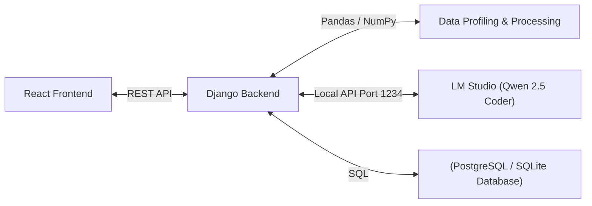

[Back to Documentation Home](../../README.md)

# Backend Architecture

This document provides a technical specification of the **InsightFlow Backend**. The backend is built using **Django** and **Django REST Framework (DRF)** in Python, designed to handle data ingestion, automated profiling with Pandas, and local LLM integration via LM Studio.

## 1. System Components



*   **Django Web Server:** Serves the API, handles authentication, routes requests, and manages transactions.
*   **Django REST Framework:** Serialization of database models and structured REST controllers.
*   **Pandas & NumPy:** In-memory dataset manipulation, type inference, profiling statistics, and duplicate/missing value processing.
*   **LM Studio Proxy client:** Sends structured prompts to the local LLM endpoint (`http://localhost:1234/v1`) for complex reasoning tasks (DAX, modeling, cleaning advice).

## 2. Directory Layout

The backend directory will be organized as follows:

```text
backend/
├── .venv/                  # Python virtual environment (ignored in git)
├── .env                    # Environment variables (DB_URL, LM_STUDIO_URL, etc.)
├── requirements.txt        # Python dependency manifest
├── manage.py               # Django management script
│
├── config/                 # Django project settings and root urls
│   ├── __init__.py
│   ├── settings.py         # Main configuration (CORS, REST framework, DB)
│   ├── urls.py             # Root url routing
│   └── wsgi.py / asgi.py
│
└── apps/                   # Application modular components
    ├── __init__.py
    ├── core/               # Shared base classes, custom exceptions, helpers
    ├── authentication/     # User register, login, and JWT settings
    ├── datasets/           # Dataset storage, Pandas profiling, cleaning engines
    └── analytics/          # LLM assistant, DAX builder, and dashboard blueprinting
```

## 3. Technology & Package Specifications

The backend environment will install the following packages:
*   `Django>=5.0` - Main MVC framework.
*   `djangorestframework` - REST API building block.
*   `django-cors-headers` - Setup CORS to securely accept requests from the Vite React app.
*   `pandas` - In-memory data loading and statistics.
*   `numpy` - High-performance numerical calculations.
*   `openai` - For connecting to the OpenAI-compatible LM Studio server.
*   `python-dotenv` - For environment variable support.
*   `openpyxl` - Required for Pandas to parse Excel `.xlsx` files.
